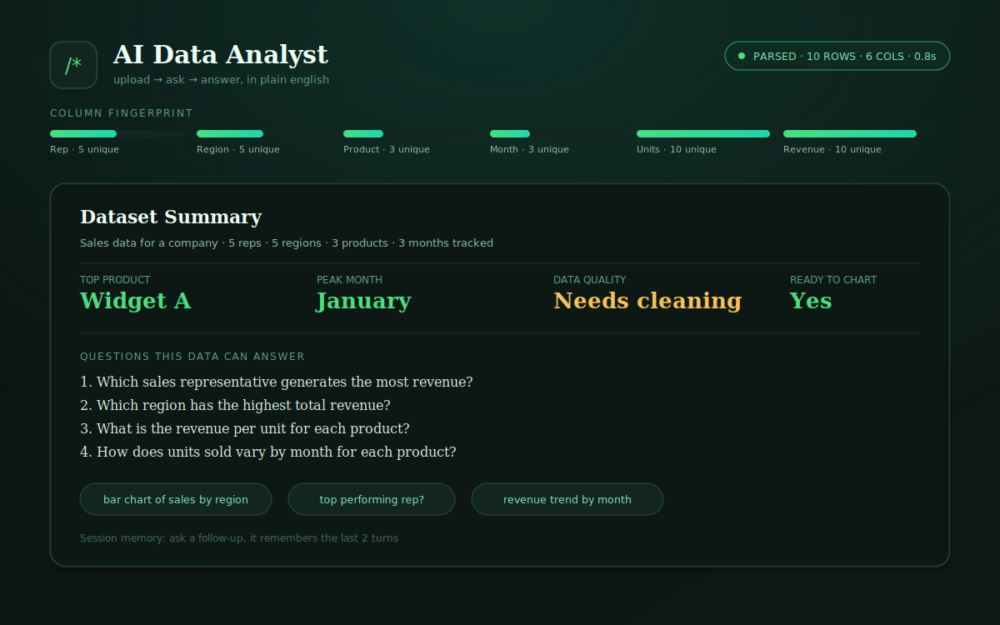
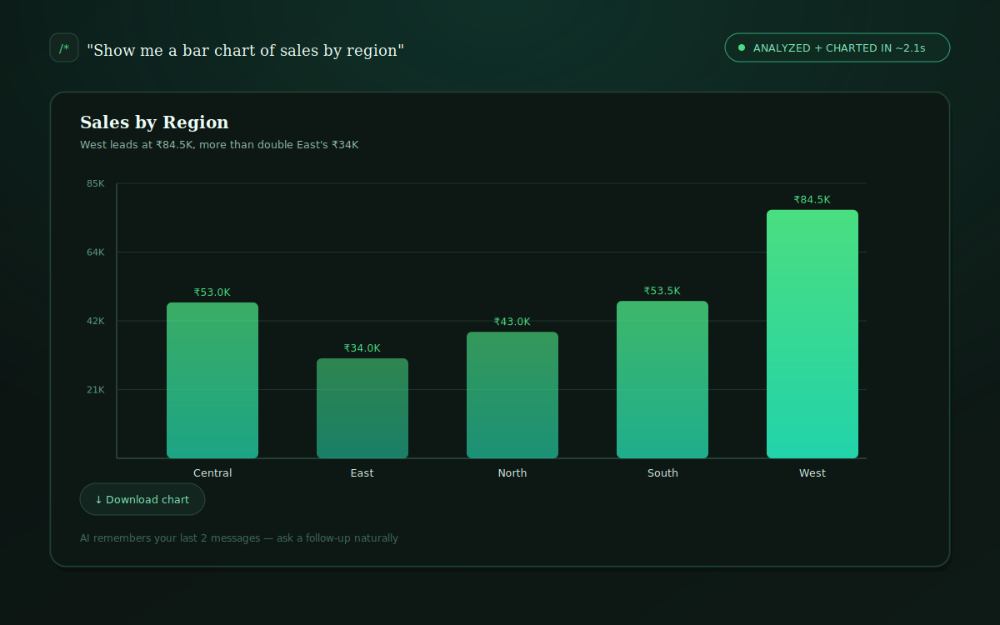

# 🤖 AI Data Analyst

Upload your data — CSV, Excel, PDF, Parquet, XML, SQLite, ODS, or Feather. Ask questions in plain English. Get instant charts & insights.

[](https://askthedata-ai.streamlit.app/)
[](https://ai-data-analyst-fdcx.onrender.com)
[](LICENSE)
[](https://github.com/ayush-s-tomar/ai-data-analyst/actions/workflows/ci.yml)
[](https://github.com/user-attachments/assets/8920ab9e-936d-456d-b58d-496543618e43)

## 📸 Demo






Asking *"Show me the sales rep performance heatmap by region"* generates an interactive heatmap instantly — no code required.

🎬 **Full walkthrough:**

https://github.com/user-attachments/assets/8920ab9e-936d-456d-b58d-496543618e43

## ✨ Features

| Feature | Description |
|---|---|
| 📁 Multi-format upload | Drag and drop CSV, Excel, PDF, Parquet, XML, SQLite, ODS, or Feather — no setup, no conversion |
| 💬 Natural language queries | Ask questions the way you'd ask a colleague |
| 📊 Auto-generated charts | Bar, line, scatter, heatmap, and more |
| 🧠 Session memory | Follow-up questions build on previous answers |
| ⚡ Fast inference | Powered by Groq's free Llama 3.3 70B |
| 🆓 100% free to run | No paid API keys required |

## 📂 Supported File Formats

| Format | Extension |
|---|---|
| CSV | `.csv` |
| Excel | `.xlsx`, `.xls` |
| PDF | `.pdf` |
| Parquet | `.parquet` |
| XML | `.xml` |
| SQLite | `.db`, `.sqlite` |
| OpenDocument Spreadsheet | `.ods` |
| Feather | `.feather` |

## 🌐 Live Links

| Service | URL |
|---|---|
| App (Streamlit) | [askthedata-ai.streamlit.app](https://askthedata-ai.streamlit.app/) |
| Backend API | [ai-data-analyst-fdcx.onrender.com](https://ai-data-analyst-fdcx.onrender.com) |

⏳ **Note:** The Render backend runs on the free tier and may take 30–60 seconds to wake up after a period of inactivity.

## 🛠️ Tech Stack

| Layer | Technology |
|---|---|
| Frontend | React / Streamlit |
| Backend | FastAPI, Python |
| AI Model | Groq API — Llama 3.3 70B |
| Data Processing | pandas, matplotlib |
| Hosting | Streamlit Community Cloud · Vercel · Render |

## 🚀 Local Setup (Windows)

### Prerequisites

Get a free Groq API key — no credit card needed:

1. Sign up at [console.groq.com](https://console.groq.com)
2. Go to **API Keys** → **Create API Key**
3. Copy it — you'll need it in Step 2

### Step 1 — Extract & Open

Extract `ai-data-analyst.zip` anywhere, then open that folder in VS Code.

### Step 2 — Backend

Open a PowerShell terminal and run each line separately:

```powershell
cd backend
python -m venv venv
venv\Scripts\activate
pip install -r requirements.txt
copy .env.example .env
```

Open `.env` and set your key:

```
GROQ_API_KEY=gsk_your_key_here
```

Start the server:

```powershell
uvicorn main:app --reload --port 8000
```

✅ Backend running at `http://localhost:8000`

### Step 3 — Frontend

Open a new terminal tab and run:

```powershell
cd frontend
npm install
npm start
```

✅ App running at `http://localhost:3000`

## ☁️ Free Production Deployment

### Backend → Render.com

1. Push your project to GitHub
2. Render → New Web Service → connect your repo
3. Set Root Directory to `backend`
4. Build command: `pip install -r requirements.txt`
5. Start command: `uvicorn main:app --host 0.0.0.0 --port $PORT`
6. Add environment variable: `GROQ_API_KEY = your key`
7. Deploy → copy your URL (e.g. `https://your-app.onrender.com`)

### App → Streamlit Community Cloud

1. Streamlit Cloud → New app → connect the same repo
2. Set entry point to `streamlit_app/`
3. Add secret: `GROQ_API_KEY = your key`
4. Deploy

## 📂 Project Structure

```
ai-data-analyst/
├── backend/
│   ├── main.py               # FastAPI app & Groq integration
│   ├── requirements.txt
│   └── .env.example
├── frontend/
│   ├── src/
│   │   ├── App.js            # Main React component
│   │   └── App.css
│   └── package.json
├── streamlit_app/            # Single-service Streamlit deployment
└── render.yaml                # Render deployment config
```

## 💡 Example Prompts

Try asking things like:

- "Show me a bar chart of sales by region"
- "What's the revenue trend over time?"
- "Which product performs best by units sold?"
- "Compare customer ratings across segments"
- "Show me the sales rep performance heatmap by region"

## 📄 License

MIT — free to use, modify, and deploy.