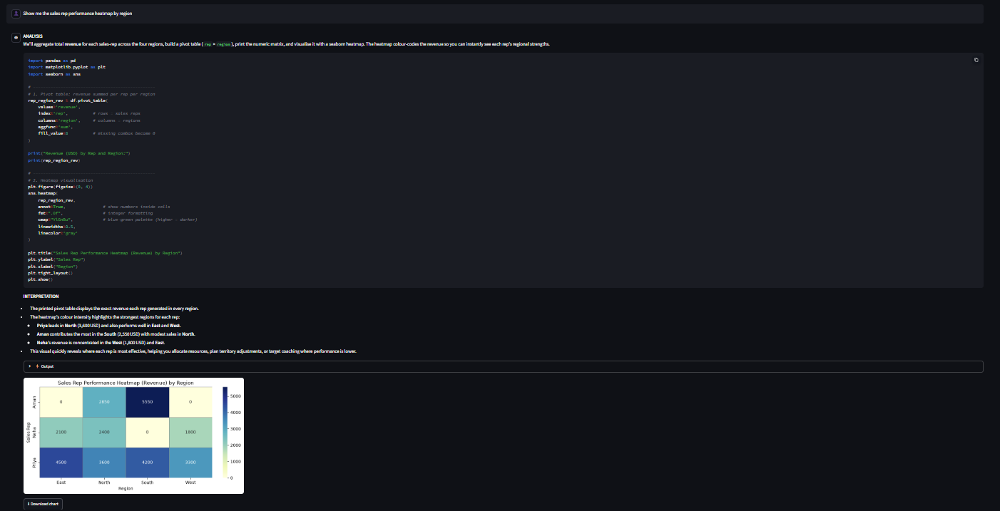

# 🤖 AI Data Analyst

Upload your data — CSV, Excel, PDF, Parquet, XML, SQLite, ODS, or Feather. Ask questions in plain English. Get instant charts & insights.

[](https://askthedata-ai.streamlit.app/)
[](https://askthedata-ai.streamlit.app/)
[](LICENSE)
[](https://github.com/ayush-s-tomar/ai-data-analyst/actions/workflows/ci.yml)

## 📸 Demo



Asking *"Show me the sales rep performance heatmap by region"* generates an interactive heatmap instantly — no code required. The AI writes the pandas/seaborn code, runs it, and explains what the results mean.

## ✨ Features

| Feature | Description |
|---|---|
| 📁 Multi-format upload | Drag and drop CSV, Excel, PDF, Parquet, XML, SQLite, ODS, or Feather — no setup, no conversion |
| 💬 Natural language queries | Ask questions the way you'd ask a colleague |
| 📊 Auto-generated charts | Bar, line, scatter, heatmap, and more |
| 🧠 Session memory | Follow-up questions build on previous answers |
| ⚡ Fast inference | Powered by Groq's LPU hardware |
| 🆓 100% free to run | No paid API keys required |

## 📂 Supported File Formats

| Format | Extension |
|---|---|
| CSV | `.csv` |
| Excel | `.xlsx`, `.xls` |
| PDF | `.pdf` |
| Parquet | `.parquet` |
| XML | `.xml` |
| SQLite | `.db`, `.sqlite` |
| OpenDocument Spreadsheet | `.ods` |
| Feather | `.feather` |

## 🌐 Live Demo

**[askthedata-ai.streamlit.app](https://askthedata-ai.streamlit.app/)** — single-service Streamlit app, no backend wake-up delay.

## 🛠️ Tech Stack

| Layer | Technology |
|---|---|
| App | Streamlit |
| AI Model | Groq API — `openai/gpt-oss-120b` |
| Data Processing | pandas, matplotlib, seaborn |
| Hosting | Streamlit Community Cloud |

## 🔄 Why Streamlit over FastAPI + React?

This project originally shipped as a FastAPI backend + React frontend, deployed on Render + Vercel. That setup meant two services to keep alive, a keep-alive ping workaround for Render's free-tier cold starts, and CORS/deployment coordination across two platforms for a single-user data tool that didn't need it.

Streamlit collapses that into one file, one deployment target, and zero cold-start delay — a better fit for the actual use case. The legacy code is kept for reference (see below) but is no longer the deployed path.

## 🚀 Local Setup

### Prerequisites

Get a free Groq API key — no credit card needed:

1. Sign up at [console.groq.com](https://console.groq.com)
2. Go to **API Keys** → **Create API Key**

### Run it

```powershell
git clone https://github.com/ayush-s-tomar/ai-data-analyst.git
cd ai-data-analyst/streamlit_app
python -m venv venv
venv\Scripts\activate
pip install -r requirements.txt
```

Create `.streamlit/secrets.toml` inside `streamlit_app/`:

```toml
GROQ_API_KEY = "gsk_your_key_here"
```

Start the app:

```powershell
streamlit run streamlit_app.py
```

✅ App running at `http://localhost:8501`

## ☁️ Deployment (Streamlit Community Cloud)

1. Push your project to GitHub
2. Streamlit Cloud → New app → connect your repo
3. Set entry point to `streamlit_app/streamlit_app.py`
4. Add secret: `GROQ_API_KEY = your key`
5. Deploy

## 📂 Project Structure

```
ai-data-analyst/
├── streamlit_app/
│   ├── streamlit_app.py      # Main app — file parsing, Groq integration, UI
│   ├── requirements.txt
│   └── .streamlit/           # secrets.toml (gitignored)
├── legacy/
│   ├── backend/               # Archived FastAPI backend (not deployed)
│   └── frontend/              # Archived React frontend (not deployed)
└── assets/                    # Demo images and screenshots
```

> `backend/` and `frontend/` are archived under `legacy/` for reference only — see [`legacy/README.md`](legacy/README.md) for why they were retired. They are not maintained and not part of the active deployment.

## 💡 Example Prompts

Try asking things like:

- "Show me a bar chart of sales by region"
- "What's the revenue trend over time?"
- "Which product performs best by units sold?"
- "Compare customer ratings across segments"
- "Show me the sales rep performance heatmap by region"

## 📄 License

MIT — free to use, modify, and deploy.